# Операционные системы UNIX/Linux (Базовый)

Установка и обновления системы Linux. Основы администрирования

## Оглавление
[Часть 1. Установка ОС](#часть-1-установка-ос)  
[Часть 2. Создание пользователя](#часть-2-создание-пользователя)  
[Часть 3. Настройка сети ОС](#часть-3-настройка-сети-ос)  
[Часть 4. Обновление ОС](#часть-4-обновление-ос)  
[Часть 5. Использование команды  sudo](#часть-5-использование-команды-sudo)  
[Часть 6. Установка и настройка службы времени](#часть-6-установка-и-настройка-службы-времени)  
[Часть 7. Установка и использование текстовых редакторов](#часть-7-установка-и-использование-текстовых-редакторов)  
[Часть 8. Установка и базовая настройка сервиса SSHD](#часть-8-установка-и-базовая-настройка-сервиса-sshd)   
[Часть 9. Установка и использование утилит top, htop](#часть-9-установка-и-использование-утилит-top-htop)   
[Часть 10. Использование утилиты fdisk](#часть-10-использование-утилиты-fdisk)   
[Часть 11. Использование утилиты df](#часть-11-использование-утилиты-df)    
[Часть 12. Использование утилиты du](#часть-12-использование-утилиты-du)    
[Часть 13. Установка и использование утилиты ncdu](#часть-13-установка-и-использование-утилиты-ncdu)    
[Часть 14. Работа с системными журналами](#часть-14-работа-с-системными-журналами)     
[Часть 15. Использование планировщика заданий CRON](#часть-15-использование-планировщика-заданий-cron)    

## Часть 1. Установка ОС

Установлена `Ubuntu 20.04 Server LTS` без графического интерфейса `cat /etc/issue`

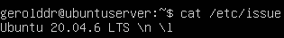

## Часть 2. Создание пользователя

Создаю нового пользователя командой `sudo useradd`

Добавляю пользователя в группу adm `sudo usermod -aG adm`

Вывод команды `cat /etc/passwd`

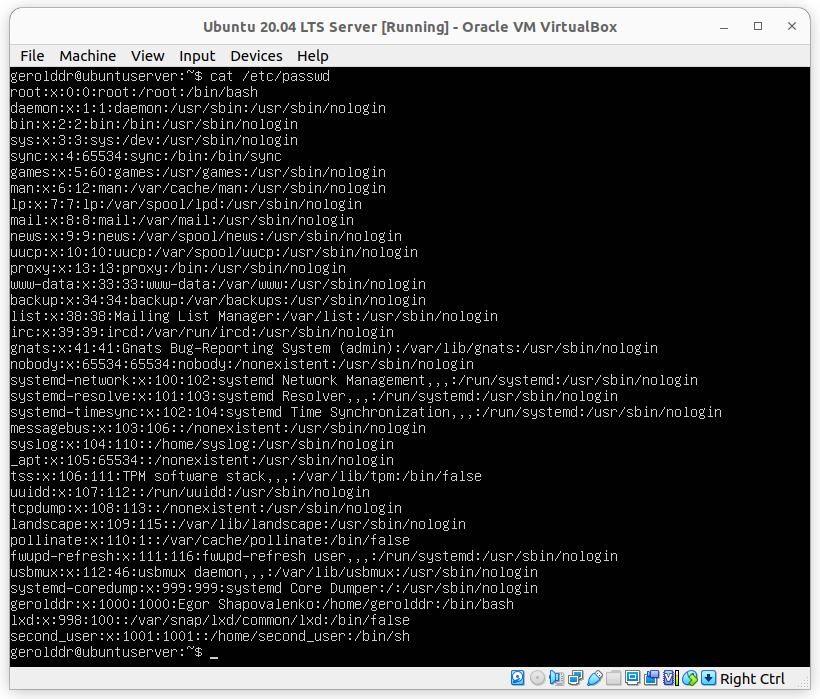

## Часть 3. Настройка сети ОС
##### 3.1. Задаем название машины вида user-1

Узнаю текущее имя хоста `hostname`

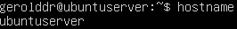

Меняю имя хоста `sudo hostnamectl set-hostname user-1` и проверяю изменения

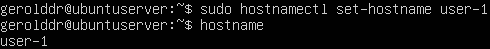

Перезапускаю систему `sudo reboot`, чтобы отобразить изменения

##### 3.2. Устанавливаем временную зону, соответствующую текущему местоположению

Устанавливаю временную зону `sudo timedatectl set-timezone Europe/Moscow`и проверяю изменения

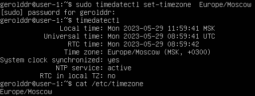

##### 3.3. Выводим названия сетевых интерфейсов с помощью консольной команды

Вывожу названия сетевых интерфейсов `ip link show`

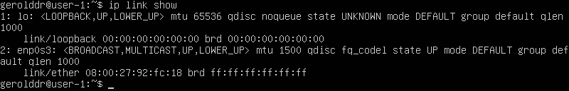

>lo (loopback device) – виртуальный интерфейс, присутствующий по умолчанию в любом Linux. Он используется для отладки сетевых программ и запуска серверных приложений на локальной машине. С этим интерфейсом всегда связан адрес 127.0.0.1. У него есть dns-имя – localhost.

##### 3.4. Используя консольную команду, получаем ip адрес устройства, на котором работаем, от DHCP сервера

Используя команду `ip address`, мы сможем получить ip адрес устройства, на котором работаем, от DHCP сервера  
Команда `hostname -I` покажет все сетевые адреса хоста (системы), кроме интерфейса loopback

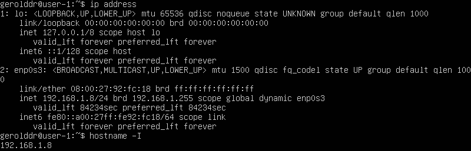

>DHCP (англ. Dynamic Host Configuration Protocol — протокол динамической настройки узла) — прикладной протокол, позволяющий сетевым устройствам автоматически получать IP-адрес и другие параметры, необходимые для работы в сети TCP/IP. Данный протокол работает по модели «клиент-сервер». Для автоматической конфигурации компьютер-клиент на этапе конфигурации сетевого устройства обращается к так называемому серверу DHCP и получает от него нужные параметры. Сетевой администратор может задать диапазон адресов, распределяемых сервером среди компьютеров. Это позволяет избежать ручной настройки компьютеров сети и уменьшает количество ошибок. Протокол DHCP используется в большинстве сетей TCP/IP.

##### 3.5. Определяем и выводим на экран внешний ip-адрес шлюза (ip) и внутренний IP-адрес шлюза, он же ip-адрес по умолчанию (gw)

Определяю внешний ip `curl ident.me`, и внутренний `ip route  | grep default`

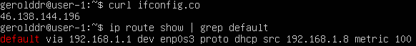

##### 3.6. Задаем статичные настройки ip, gw, dns

Перехожу к файлу конфигурации `sudo nano /etc/netplan/00-installer-config.yaml`, вношу необходимые изменения

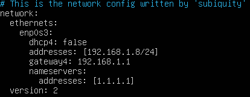

Запускаю команду `sudo netplan apply` для обновления конфигурации

##### 3.7. Перезагружаем виртуальную машину. Убеждаемся, что статичные сетевые настройки (ip, gw, dns) соответствуют заданным в предыдущем пункте

Перезапускаю машину командой `sudo reboot`

Проверяю изменения `ip address show` и `ip route  | grep default`

Вижу, что настройки стали статическими

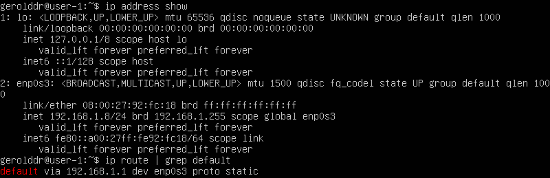

Пингую 1.1.1.1 и ya.ru

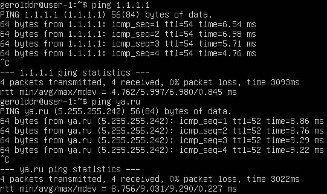

## Часть 4. Обновление ОС
##### Обновляем системные пакеты до последней на момент выполнения задания версии

Запускаю обновление командой `sudo apt upgrade`

После обновления ввожу команду повторно

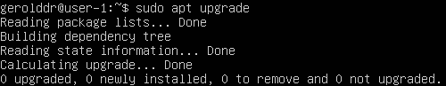

## Часть 5. Использование команды  sudo

>sudo (англ. Substitute User and do, дословно «подменить пользователя и выполнить») — программа для системного администрирования UNIX-систем, позволяющая делегировать те или иные привилегированные ресурсы пользователям с ведением протокола работы. Основная идея — дать пользователям как можно меньше прав, при этом достаточных для решения поставленных задач. Команда sudo предоставляет возможность пользователям выполнять команды от имени суперпользователя root, либо других пользователей.

##### Разрешаю пользователю, созданному в части 2, выполнять команду sudo

Добавляю пользователя в группу sudo командой `sudo usermod -aG sudo`

Переключаюсь на пользователя "second_user" командой `sudo su` и меняю имя хоста

## Часть 6. Установка и настройка службы времени
##### Настройка службы автоматической синхронизации времени

Вывожу время часового пояса, в котором нахожусь `timedateclt show`

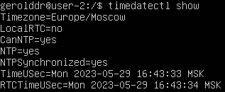

## Часть 7. Установка и использование текстовых редакторов
##### Устанавливаю текстовые редакторы VIM (+ любые два по желанию NANO, MCEDIT, JOE и т.д.)

Устанавливаю vim `sudo apt install vim`

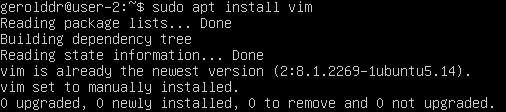

Устанавливаю nano `sudo apt install nano`

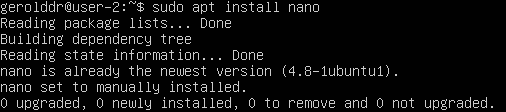

Устанавливаю joe `sudo apt install joe`

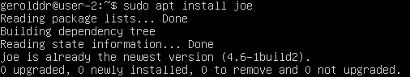

##### Редактор vim

Создаю файл `vim test_VIM.txt`, записываю ник и выхожу с сохранением

- :wq - выйти с сохранением

Повторно открываю файл, заменяю ник на "21 school 21" и выхожу без сохранения

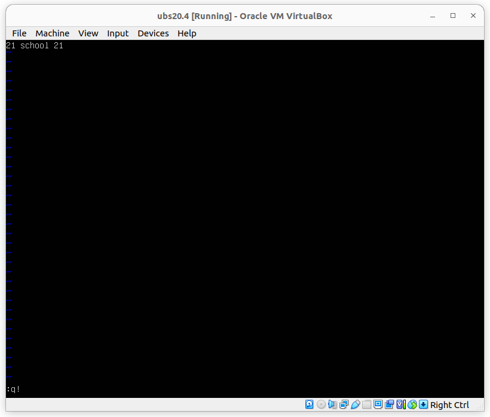

- :q! - выйти без сохранения

Повторно открываю файл, заменяю ник на "21 school 21" с помощью поиска

- :s/gerolddr/21 School 21 - поиск и замена

##### Редактор nano

Создаю файл `nano test_NANO.txt`, записываю ник и выхожу с сохранением

- ctrl + x - выход из редактора. y - соглашаемся с сохранением

Повторно открываю файл, заменяю ник на "21 school 21" и выхожу без сохранения

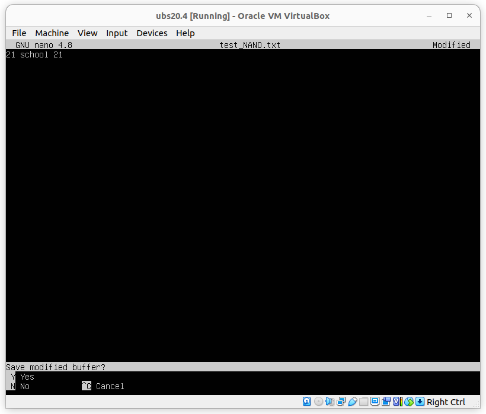

- ctrl + x - выход из редактора. n - отказываемся от сохранением

Повторно открываю файл, заменяю ник на "21 school 21" с помощью поиска

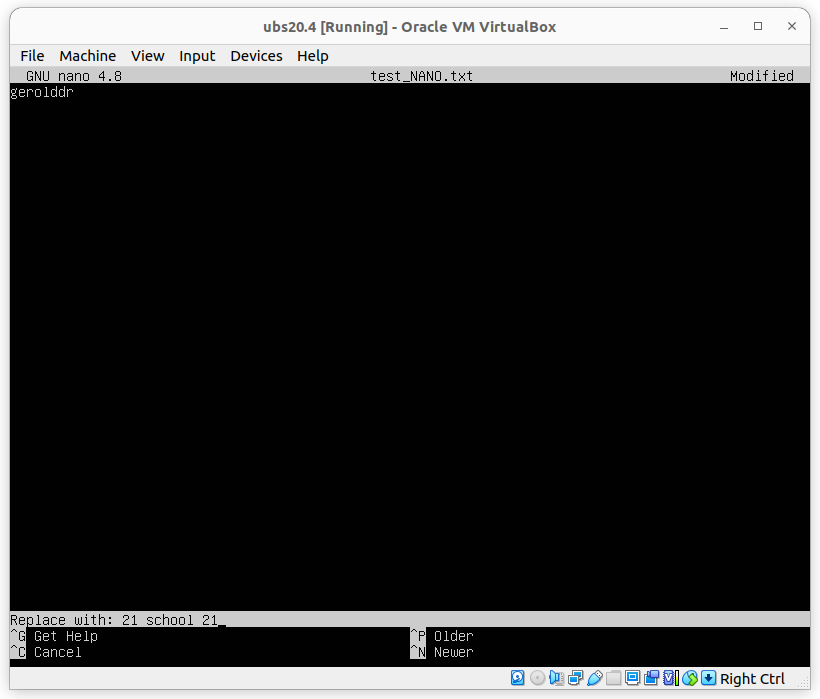

- ctrl + \ - поиск и замена

##### Редактор joe

Создаю файл `nano test_JOE.txt`, записываю ник и выхожу с сохранением

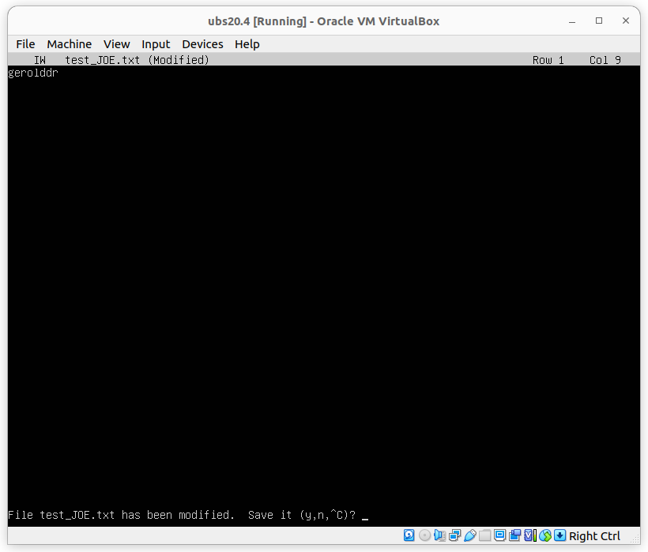

- ctrl + k + q - выход из редактора. y - соглашаемся с сохранением

Повторно открываю файл, заменяю ник на "21 school 21" и выхожу без сохранения

- ctrl + k + q - выход из редактора. n - отказываемся от сохранением

Повторно открываю файл, заменяю ник на "21 school 21" с помощью поиска

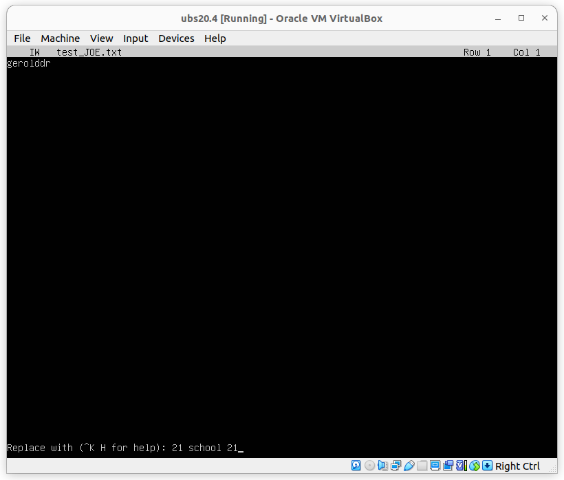

- ctrl + k + f - поиск и замена

## Часть 8. Установка и базовая настройка сервиса SSHD
##### 8.1 Установка службы SSHd

Устанавливаю SSHd командой `sudo apt install openssh-server`

##### 8.2 Добавление автостарта службы при загрузке системы

Добавляю автозапуск службы командой `sudo systemctl enable sshd`

Проверяю, работает ли служба `sudo systemctl status sshd`

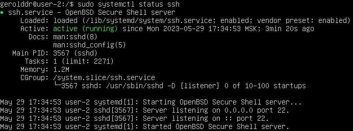

##### 8.3 Перенастройка службы SSHd на порт 2022

Прокидываю порты в VirtualBox

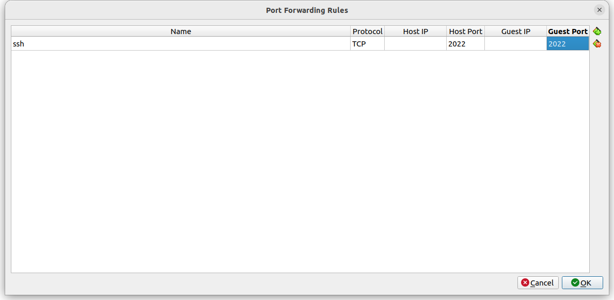

Меняю конфиг `sudo nano /etc/ssh/sshd_config`

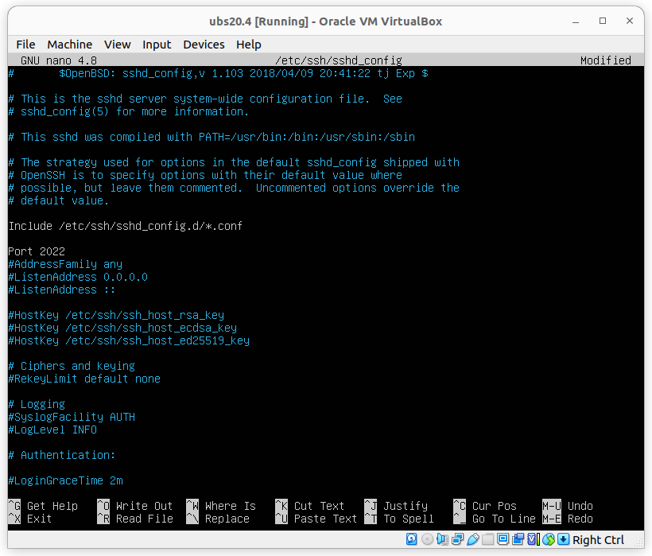

Проверяю `sudo systemctl status sshd`

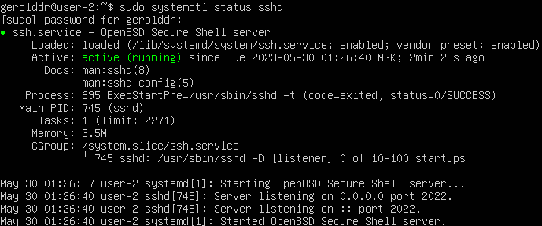

##### 8.4 Используя команду ps, показать наличие процесса sshd. Для этого к команде нужно подобрать ключи

>ps -e - показывает все запущенные процессы

Смотрю на наличие процесса `ps -e | grep sshd`

##### 8.5 Перезагрузить систему

Перезапускаем `sudo reboot`

Устанавливаем netstat `sudo apt install net-tools`

Выполняю `netstat -tan`

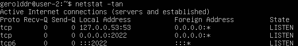

> netstat - отображение статистики сетевых соединений.

- -tan:
- -a - Показывать состояние всех сокетов; обычно сокеты, используемые серверными процессами, не показываются
- -n - Показывать сетевые адреса как числа. netstat обычно показывает адреса как символы
- -t - Отображать TCP подключения
- Proto - Содержит тип протокола
- Recv-Q - Счётчик байтов не скопированных программой пользователя из этого сокета
- Send-Q - Счётчик байтов, не подтверждённых удалённым узлом
- Local Address - Адрес и номер порта локального конца сокета
- Foreign Address - Адрес и номер порта удалённого конца сокета
- State - Состояние сокета
- LISTEN - Сокет ожидает входящих подключений
- SYN_SENT - Сокет, находящийся в режиме активной попытки установки подключения
- 0.0.0.0 - Немаршрутизируемый адрес IPv4, который используется в качестве адреса по умолчанию или адреса-заполнителя

## Часть 9. Установка и использование утилит top, htop
##### Установка и запуск утилиты top и htop

Устанавливаю утилиты `sudo apt install htop`

Вывод утилиты top

- uptime: 20 min
- кол-во авторизованных пользователей: 1
- общую загрузку системы: 0,00, 0,01, 0,05
- общее количество процессов: 103
- загрузку cpu: 0,0
- загрузку памяти: 175.5 / 1983.2
- pid процесса занимающего больше всего памяти: 682
- pid процесса, занимающего больше всего процессорного времени: 2216

Вывод утилиты htop отсортированный по PID

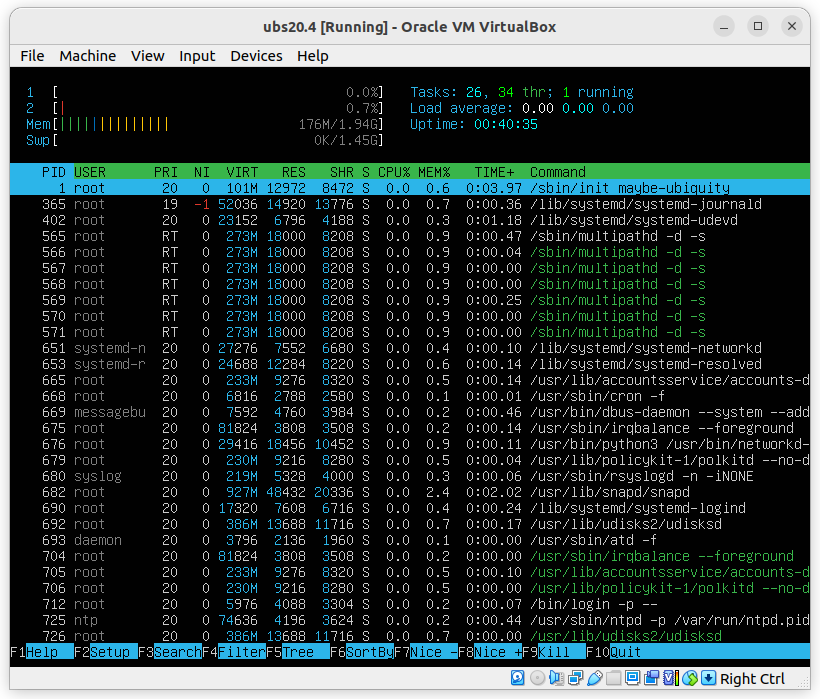

Вывод утилиты htop отсортированный по PERCENT_CPU

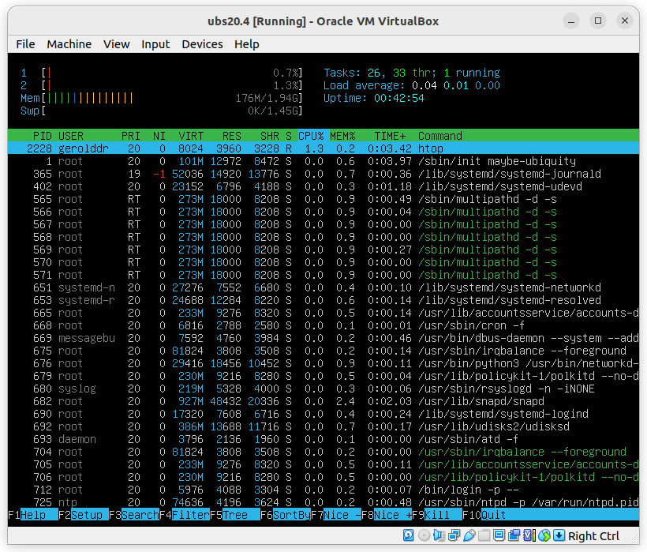

Вывод утилиты htop отсортированный по PERCENT_MEM

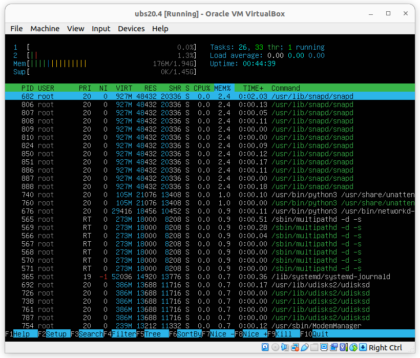

Вывод утилиты htop отсортированный по TIME

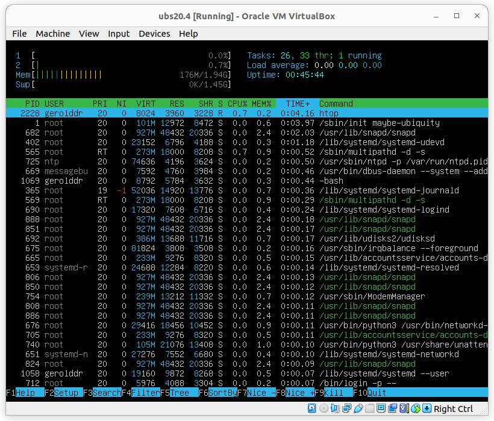

Вывод утилиты htop отфильтрованному для процесса sshd

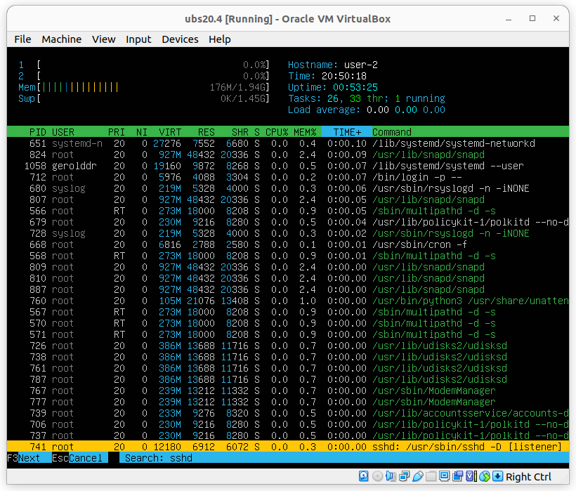

Вывод утилиты htop с процессом syslog, найденным, используя поиск

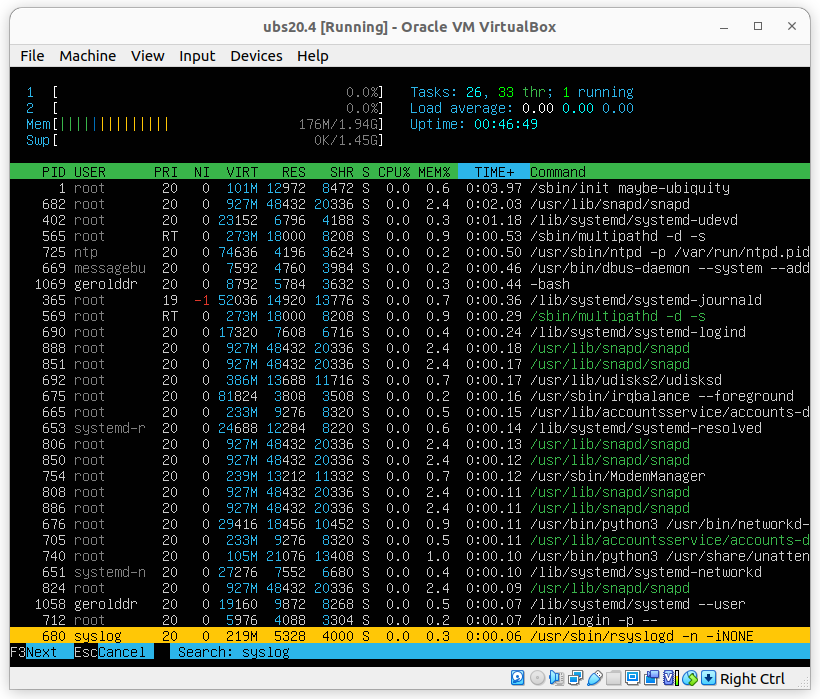

Вывод утилиты htop с добавленным выводом hostname, clock и uptime

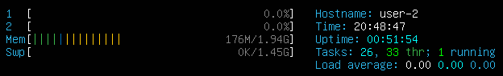

## Часть 10. Использование утилиты fdisk

Запуск утилиты `sudo fdisk -l`

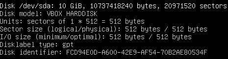

- название жесткого диска: VBOX HARDDISK
- размер: 10 GiB
- количество секторов: 20971520
- размер swap: 1.4G

## Часть 11. Использование утилиты df

>df (аббревиатура от disk free) — показывает список всех файловых систем по именам устройств, сообщает их размер, занятое и свободное пространство и точки монтирования.

##### 11.1 Запустить команду df

Запуск утилиты `df`

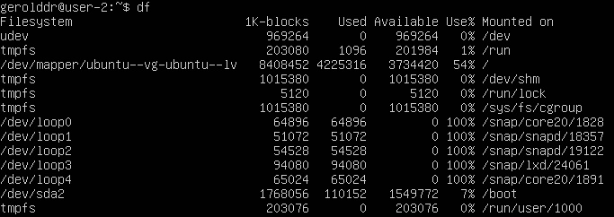

Отчет для корневого раздела(/):
- размер раздела: 8408452
- размер занятого пространства: 4225316
- размер свободного пространства: 3734420
- процент использования: 54%

Единицы измерения: 1K

##### 11.2 Запустить команду df -Th

Запуск утилиты `df -Th`

>-h - выводить размеры в читаемом виде, в мегабайтах или гигабайтах 
>-T - тип файловой системы.

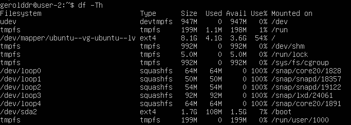

Отчет для корневого раздела(/):
- размер раздела: 8.1G
- размер занятого пространства: 4.1G
- размер свободного пространства: 3.6G
- процент использования: 54%

Тип файловой системы для раздела: ext4

## Часть 12. Использование утилиты du

>du (аббревиатура от англ. disk usage) — стандартная Unix-программа для оценки занимаемого файлового пространства. По умолчанию показывает размер файлового пространства, занимаемого каждым файлом и каталогом в текущем каталоге.

##### 12.1 Запуск команды du

Запускаю команду `du`

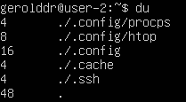

##### 12.2 Вывод размера папок /home, /var, /var/log (в байтах, в человекочитаемом виде)

Добавляю флаги и запускаю `sudo du -sh /home /var /var/log`

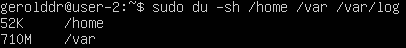

##### 12.3 Вывожу размер всего содержимого в /var/log (не общее, а каждого вложенного элемента, используя *)

Запускаю команду `sudo du -sh /var/log/*`

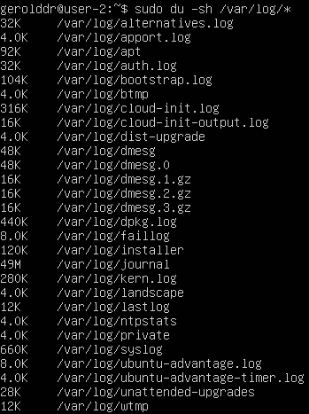

## Часть 13. Установка и использование утилиты ncdu

##### 13.1 Устанавливаю утилиту ncdu

Устанавливаю ncdu `sudo apt install ncdu`

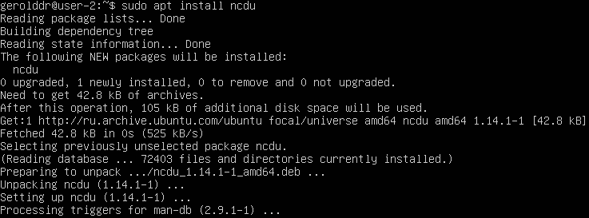

##### 13.2 Вывожу размер папок /home, /var, /var/log

Вывожу размер папки /home `sudo ncdu /home`

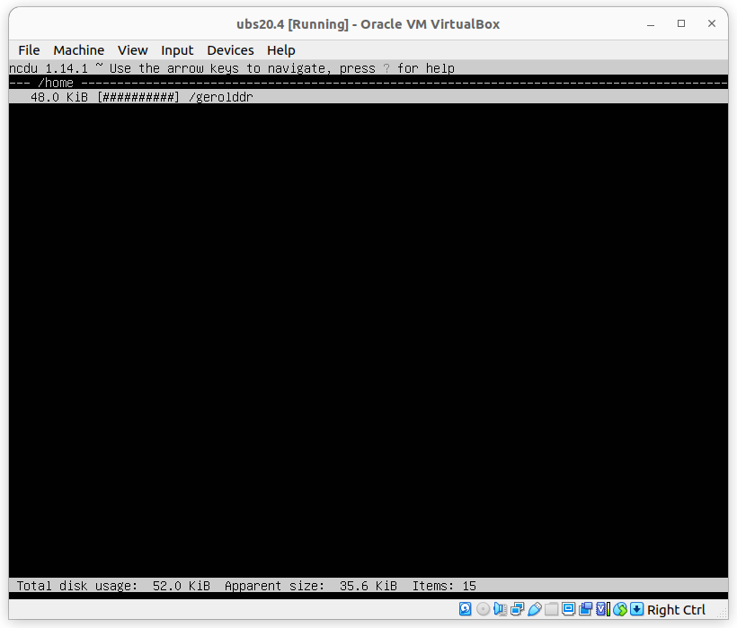

Вывожу размер папки /var `sudo ncdu /var`

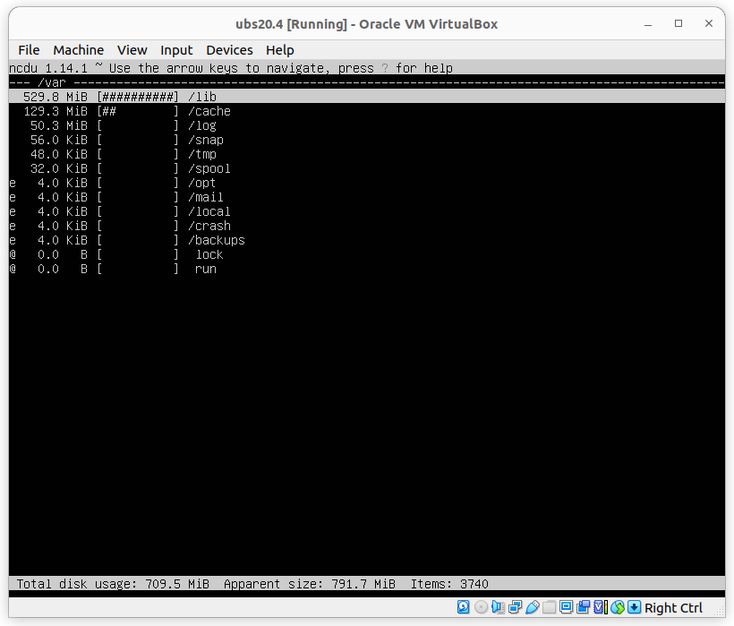

Вывожу размер папки /var/log `sudo ncdu /var/log`

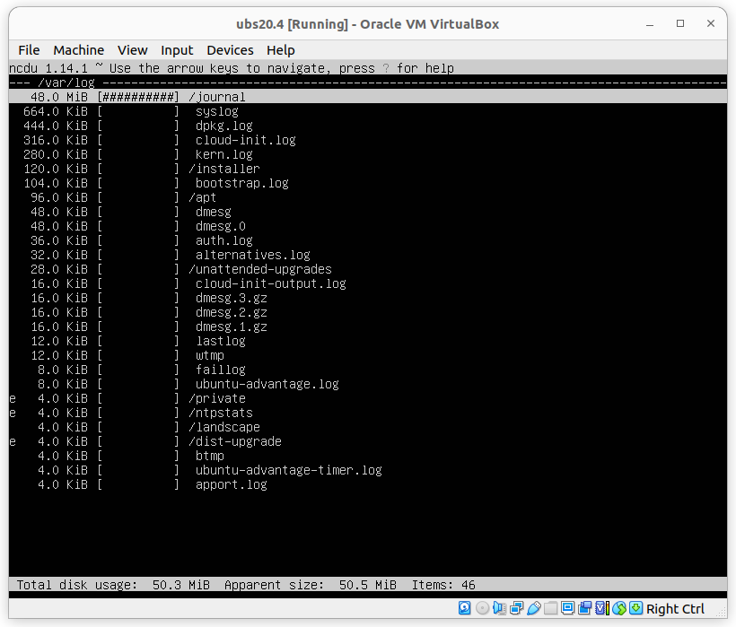

## Часть 14. Работа с системными журналами

Открываю для просмотра `cat /var/log/dmesg`

>dmesg — в этом логе хранится информация о загрузке ядра и драйверов оборудования. В момент загрузки системы записывается вся основная информация, имеющая к ней отношение.

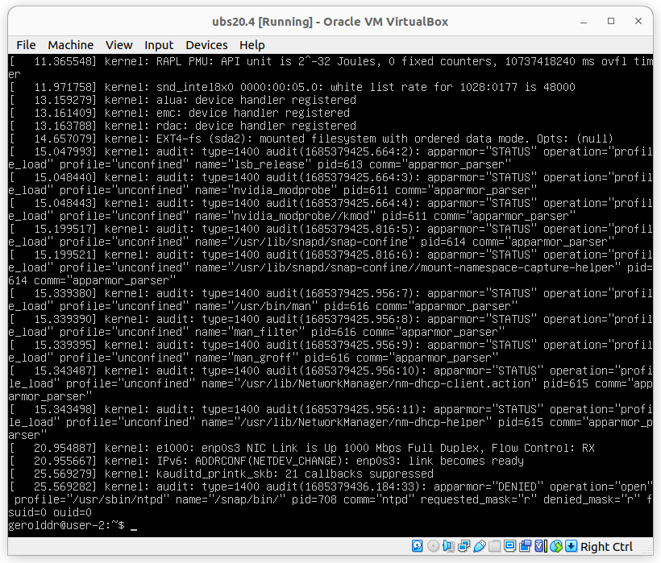

Открываю для просмотра `cat /var/log/syslog`

>syslog - глобальные системные журналы операционной системы linux. Сюда пишутся события загрузки, ядра системы, системы инициализации systemd и т.д.

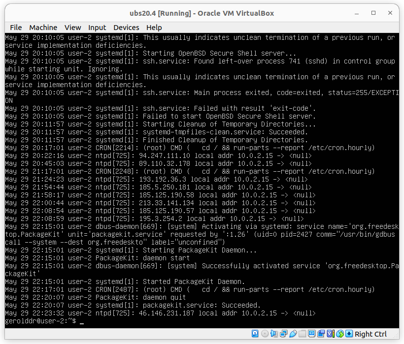

Открываю для просмотра `cat /var/log/auth.log`

>auth.log — лог авторизации и аутентификации в системе, в том числе ssh.

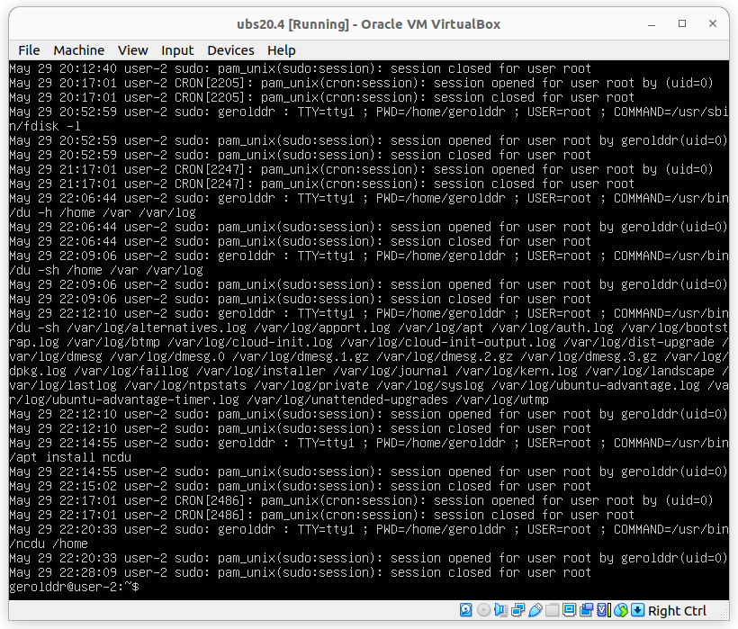

- Время последней успешной авторизации: May 29 22:20:33  
- Имя пользователя: gerolddr  
- Метод входа в систему: TTY=tty1  

##### Перезапуск sshd

Перезапускаю sshd `sudo systemctl restart sshd`

Логи о перезапуске sshd

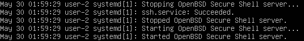

## Часть 15. Использование планировщика заданий CRON

>Cron (Command Run ON) — система для автоматического запуска программ и скриптов на сервере в определённое время.

##### 15.1 Используя планировщик заданий, запускаю команду uptime через каждые 2 минуты

Вхожу в журнал для записи заданий `crontab -e`

Добавляю задание `*/2 * * * * uptime`

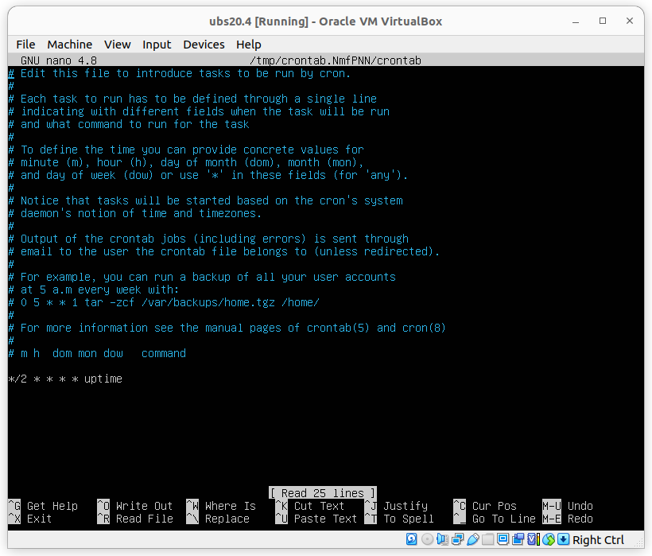

Смотрю логи `cat /var/log/syslog`

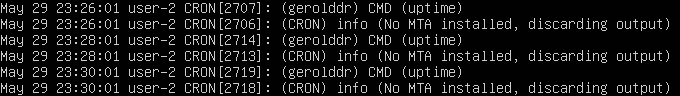

Список текущих задач для CRON `crontab -l`

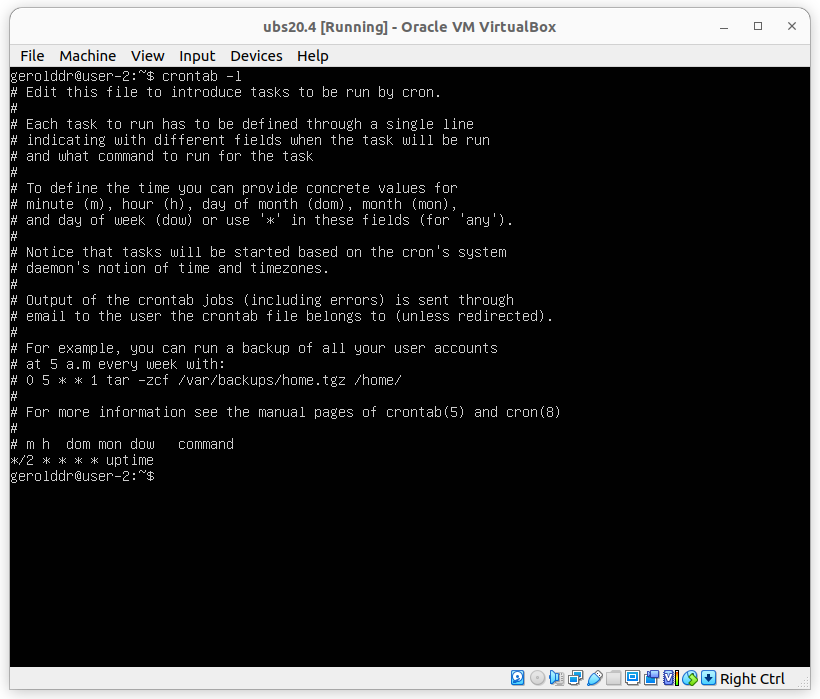

##### 15.2 Удаляю все задания из планировщика заданий

Удаляю все задания и проверяю список задач `crontab -r` `crontab -l`

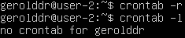
