# Simple Docker

Введение в докер. Разработка простого докер образа для собственного сервера

## Оглавление

[Часть 1. Готовый докер](#часть-1-готовый-докер)  
[Часть 2. Операции с контейнером](#часть-2-операции-с-контейнером)  
[Часть 3. Мини веб-сервер](#часть-3-мини-веб-сервер)  
[Часть 4. Свой докер](#часть-4-свой-докер)  
[Часть 5. Dockle](#часть-5-dockle)  
[Часть 6. Базовый Docker Compose](#часть-6-базовый-docker-compose)  

## Часть 1. Готовый докер

Выкачиваю [официальный](https://hub.docker.com/_/nginx) ngnix образ `docker pull nginx`

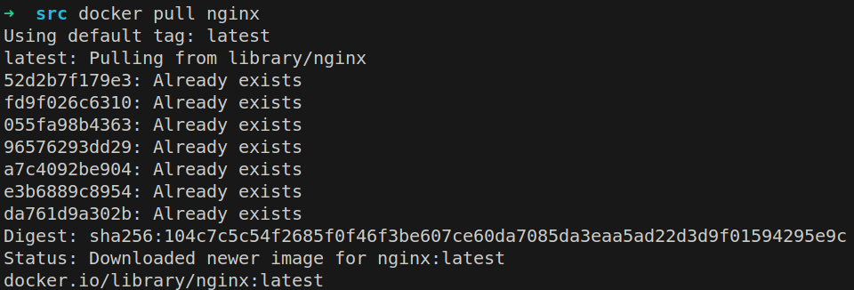

Проверяю наличие образа `docker images`

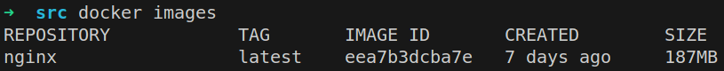

Запускаю образ `docker run -d nginx`

> -d - запуск контейнера в фоновом режиме

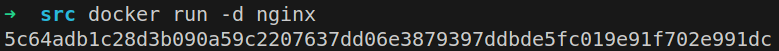

Проверяю, что образ запущен `docker ps`

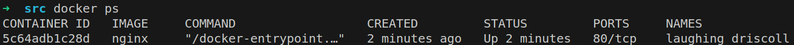

Информация о контейнере `docker inspect -s`

> -s The --size, or short-form -s, option adds two additional fields to the docker inspect output

Размер контейнера

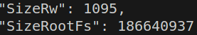

> SizeRootFs: the total size of all the files in the container, in bytes

> SizeRw: the size of the files that have been created or changed in the container, compared to it's image, in bytes

Список портов

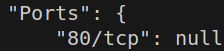

ip контейнера

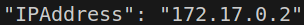

Останавливаю контейнер `docker stop`

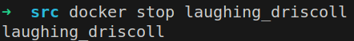

Проверяю, что образ остановлен `docker ps`

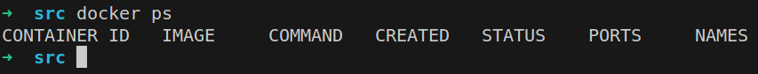

Запускаю контейнер с замапленными портами 80 и 443

`docker run -d -p 80:80 -p 443:443 nginx`

> -p: Publish a container's port(s) to the host

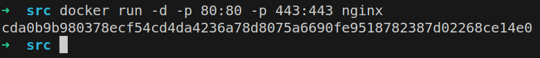

Проверяю стартовую страницу в бразузере

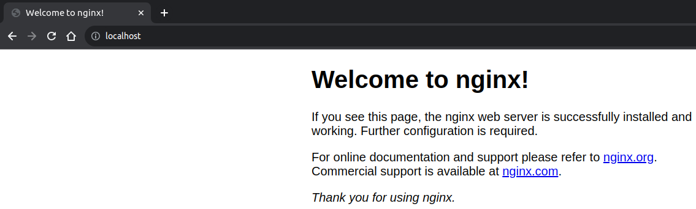

Перезапускаю контейнер `docker restart`

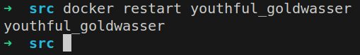

Проверяю, что образ перезапущен `docker ps`

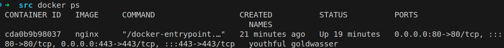

## Часть 2. Операции с контейнером

Читаю конфигурационный файл

> The docker exec command runs a new command in a running container

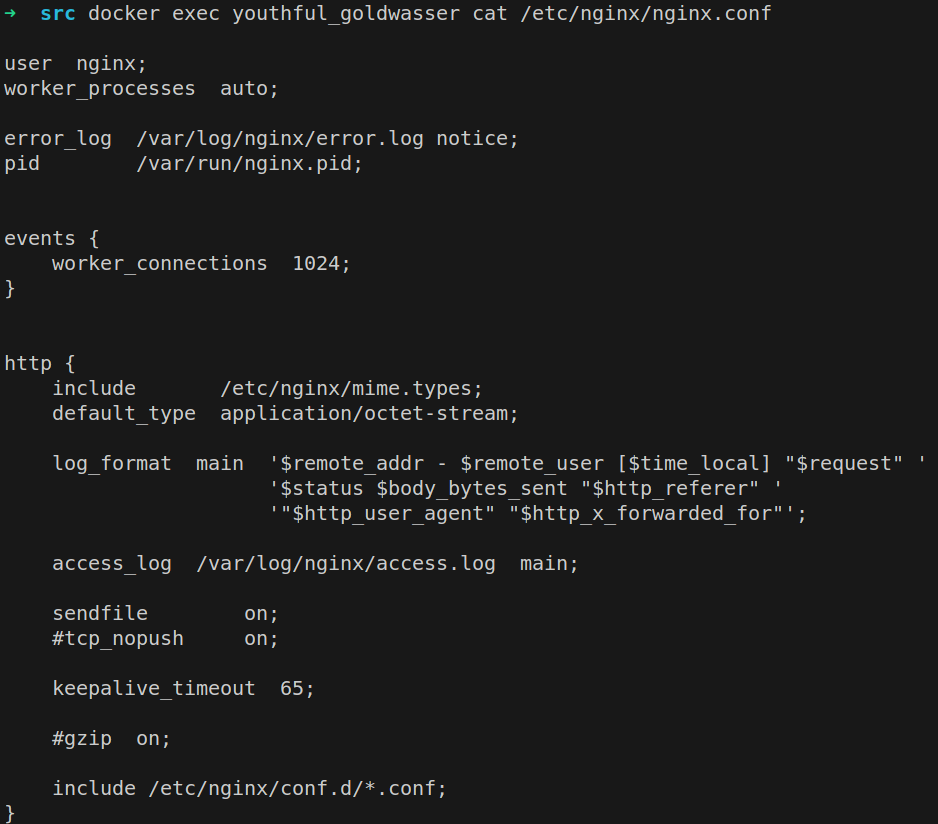

Создаю на локальной машине конфигурационный файл `touch nginx.conf`

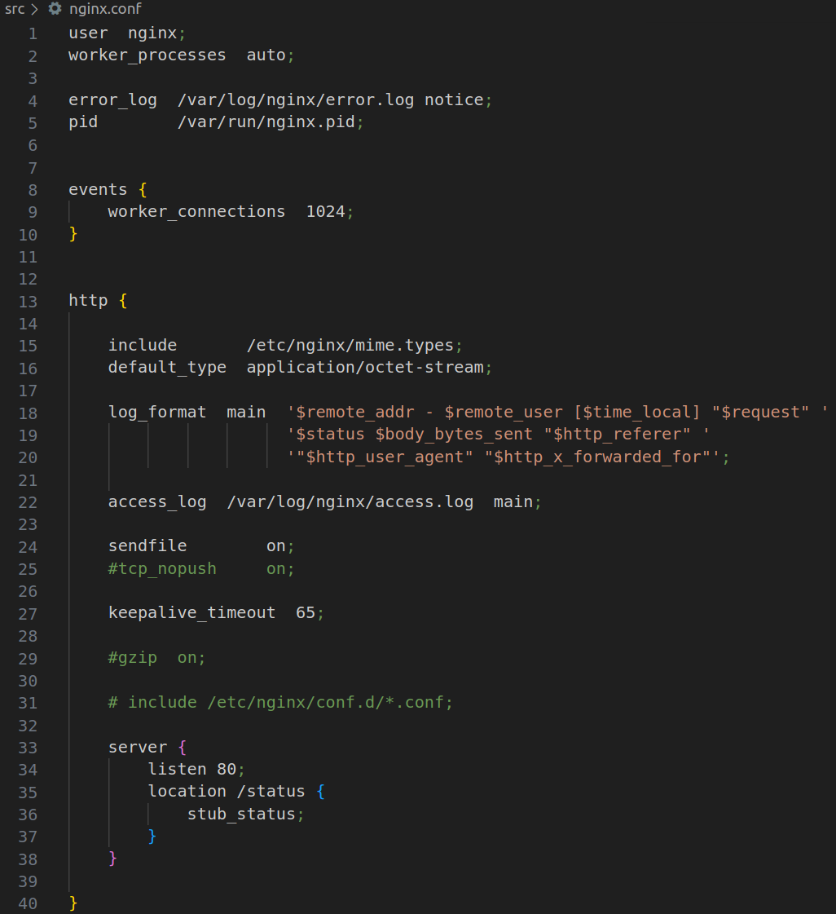

Копирую файл в nginx `docker cp`

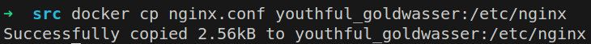

Перезапускаю nginx `nginx -s reload`

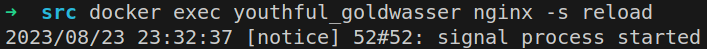

Проверяю, что все работает 

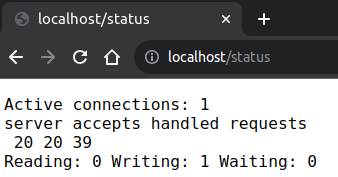

Экспортирую контейнер `docker export`

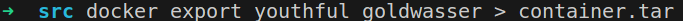

Останавливаю контейнер `docker stop`

Удаляю образ `docker rmi`

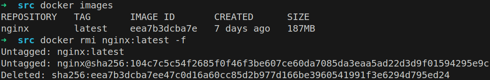

Удаляю контейнер `docker rm`

Импортирую образ `docker import`

Запускаю контейнер `docker run`

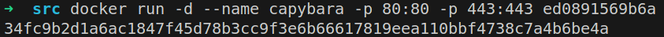

Проверяю, что все работает 

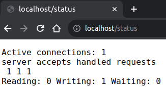

## Часть 3. Мини веб-сервер

Заново выкачиваю [официальный](https://hub.docker.com/_/nginx) ngnix образ `docker pull nginx`

Запускаю контейнер `docker run`

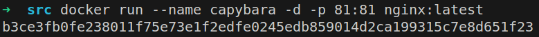

> --name: имя контейнера

Копирую файл сервера и конфигурационный файл в контейнер `docker cp`

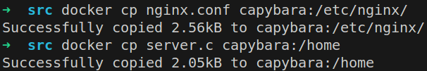

Устанавливаю необходимые пакеты в контейнер

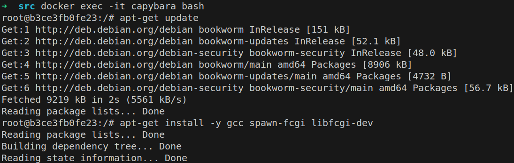

Компилирую и запускаю сервер

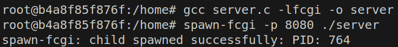

Перезапускаю nginx `nginx -s reload`

Проверяю, что все работает

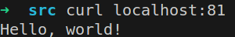

## Часть 4. Свой докер

Собираю образ `docker build` и проверяю его наличие `docker images`

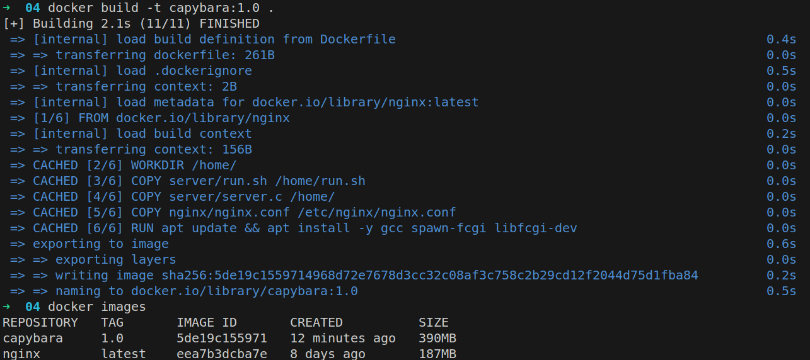

> -t: Name and optionally a tag in the name:tag format

Запускаю контейнер `docker run` и проверяю, что все работает `docker ps`

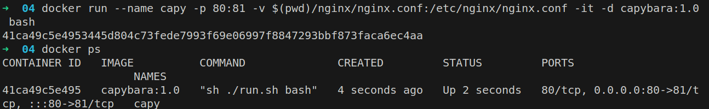

> -v: Bind mount a volume

> -i: Keep STDIN open even if not attached

> -t: Allocate a pseudo-TTY

> -p: Publish a container's port(s) to the host

Смотрю

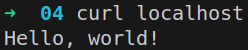

Обновляю конфиг на локальной машине, перезапускаю nginx `nginx -s reload`

Проверяю

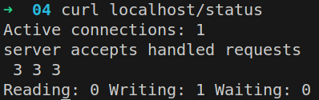

## Часть 5. Dockle

[Гайд](https://github.com/goodwithtech/dockle#installation) по установке Dockle

Проверяю -_-

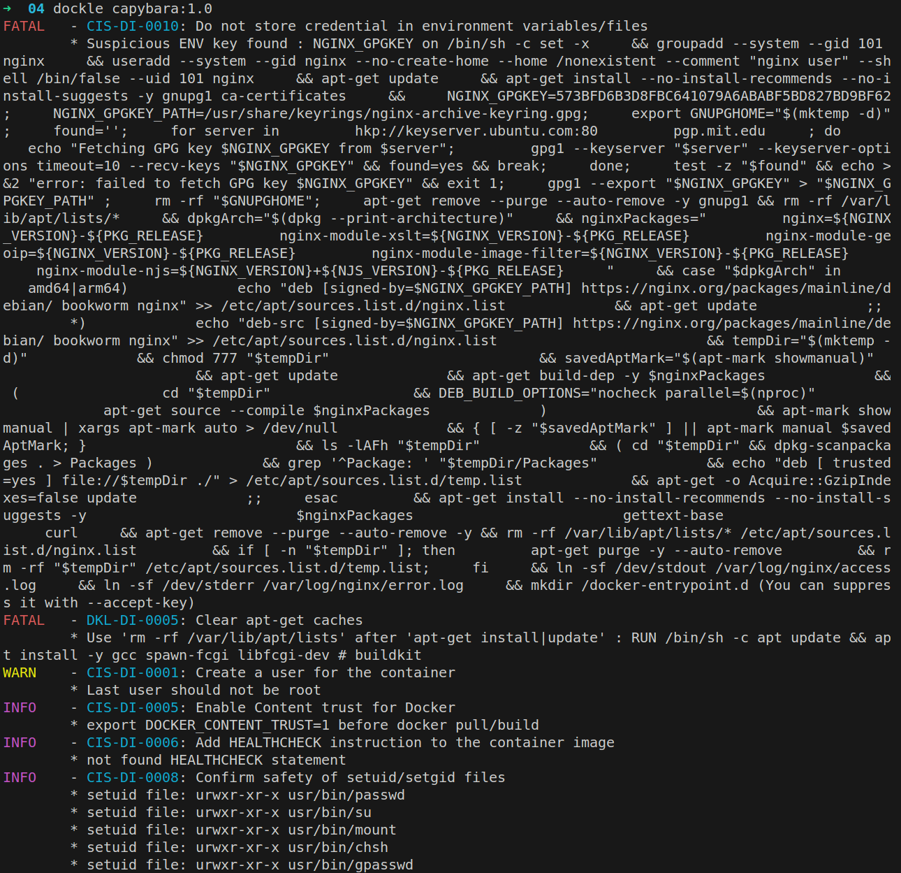

После правки

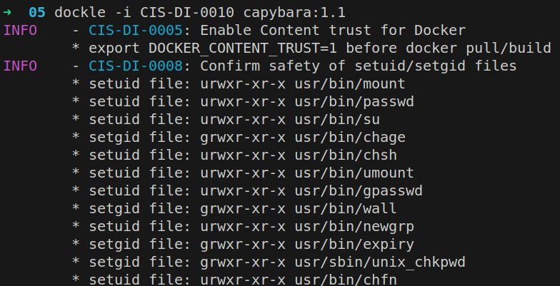

## Часть 6. Базовый Docker Compose

[Гайд](https://www.digitalocean.com/community/tutorials/how-to-install-and-use-docker-compose-on-ubuntu-20-04) по установке Docker Compose

Собираю образы `docker compose build`

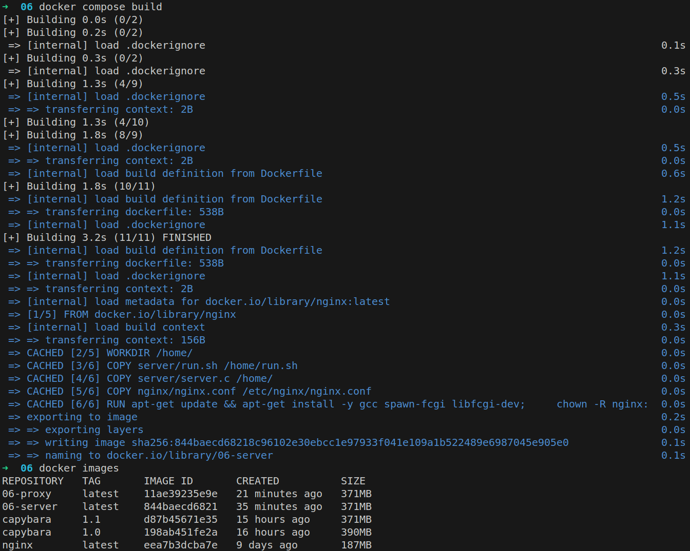

Запускаю контейнеры и проверяю, что все работает `docker compose up -d`

> -d: deamon

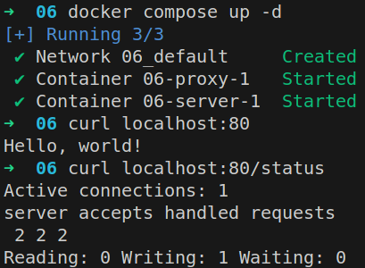
